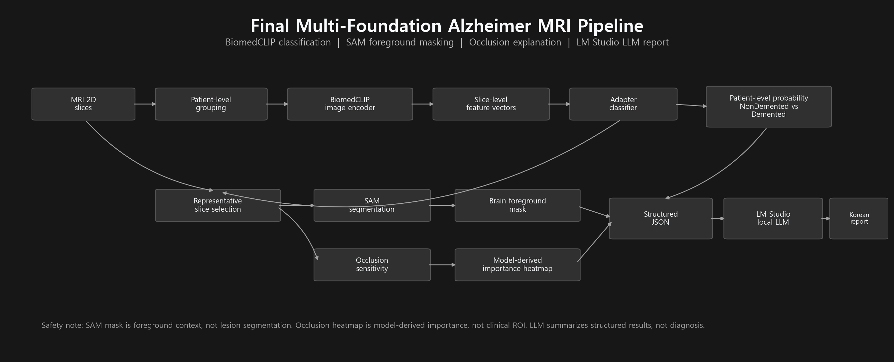

# Alzheimer MRI Multi-Foundation Screening Pipeline

This repository is a reproducible project archive for an Alzheimer MRI screening experiment built around foundation models.

The project started from BiomedCLIP-based MRI classification, corrected feature caching and data leakage risks, redefined the task as patient-level binary screening, compared several adaptation strategies, and finally connected BiomedCLIP, SAM, occlusion sensitivity, and a local LLM into a multi-foundation pipeline.

> This is a research screening pipeline, not a medical diagnostic system.



## Project Summary

- **Task:** patient-level `NonDemented` vs `Demented` screening
- **Positive class:** `VeryMildDemented + MildDemented + ModerateDemented`
- **Main classifier:** frozen BiomedCLIP image encoder + adapter probe
- **Explanation module:** SAM foreground mask + occlusion sensitivity
- **Text module:** structured JSON output summarized by LM Studio local LLM
- **Main reason for patient-level split:** prevent image-level slice leakage across train/test

## Final Model Performance

Patient-level 5-fold OOF result for the final BiomedCLIP adapter probe:

| Metric | Value |
|---|---:|
| Sensitivity | 0.889 |
| Specificity | 0.823 |
| F1 | 0.720 |
| Macro F1 | 0.803 |
| AUROC | 0.899 |
| AUPRC | 0.665 |

Full comparison is available in [`results/final_model_comparison_table.csv`](results/final_model_comparison_table.csv).

## Repository Structure

```text
.
├── README.md
├── config.example.json
├── requirements.txt
├── environment.yml
├── src/dl_project_repro/       # reusable Python code
├── scripts/                    # step-by-step reproduction scripts
├── notebooks/                  # final reproducible notebook
├── notebooks/archive/          # legacy experiment notebooks
├── docs/                       # project write-up and method notes
├── results/                    # saved CSV/JSON results
├── checkpoints/                # adapter probe checkpoints
├── reports/                    # LLM prompts and generated reports
├── assets/                     # figures for README/PPT
└── outputs/                    # generated outputs, cache, temporary files
```

## Quick Start

Create an environment:

```powershell
conda env create -f environment.yml
conda activate alzheimer-repro
```

or install with pip:

```powershell
pip install -r requirements.txt
```

Copy and edit the config:

```powershell
copy config.example.json config.local.json
```

Set `dataset_dir` in `config.local.json` to your local dataset path.

## Dataset Layout

The dataset folder should look like this:

```text
alzheimer_dataset/
  NonDemented/
  VeryMildDemented/
  MildDemented/
  ModerateDemented/
```

Each class folder should contain 2D MRI slice images such as `.jpg`, `.png`, or `.bmp`.

## Reproduction Levels

### Level 0. Inspect Saved Results

This checks the stored results without rerunning model training.

```powershell
python scripts\00_check_environment.py --config config.local.json
python scripts\04_evaluate_saved_results.py --config config.local.json
```

### Level 1. Rebuild Dataset Manifest

```powershell
python scripts\01_build_manifest.py --config config.local.json
```

### Level 2. Recompute BiomedCLIP Feature Cache

This can take time and requires GPU for practical speed.

```powershell
python scripts\02_extract_biomedclip_features.py --config config.local.json
```

Feature caching intentionally uses:

- no augmentation
- no sampler
- `shuffle=False`

This keeps the feature cache deterministic.

### Level 3. Retrain Adapter Probe

```powershell
python scripts\03_train_adapter_probe.py --config config.local.json
```

### Level 4. Regenerate LLM Reports

Start LM Studio local server first, load the configured model, then run:

```powershell
python scripts\05_generate_llm_reports.py --config config.local.json
```

## Key Design Decisions

1. **Feature cache was separated from training loader.**  
   WeightedRandomSampler and augmentation belong to training, not deterministic feature extraction.

2. **Image-level split was replaced by patient-level split.**  
   MRI datasets often contain multiple slices from the same patient. Image-level splitting can leak patient identity into both train and test.

3. **The task was redefined from 4-class to Stage 1 binary screening.**  
   `ModerateDemented` had too few patients for stable 4-class evaluation.

4. **BiomedCLIP adapter probe was selected as the final foundation-model classifier.**  
   It adapts frozen BiomedCLIP features with a small trainable head and was more stable than heavier fine-tuning attempts on small data.

5. **SAM and occlusion were used for explanation, not diagnosis.**  
   SAM foreground is not lesion segmentation. Occlusion heatmap is model-derived importance, not clinical ROI.

6. **LLM summarizes structured model output.**  
   The local LLM does not classify MRI images directly and does not diagnose.

## Main Figures

- Pipeline: [`assets/01_final_pipeline_diagram.png`](assets/01_final_pipeline_diagram.png)
- Decision flow: [`assets/02_project_decision_flow.png`](assets/02_project_decision_flow.png)
- Dataset distribution: [`assets/03_dataset_patient_distribution.png`](assets/03_dataset_patient_distribution.png)
- Model comparison: [`assets/04_model_metric_comparison.png`](assets/04_model_metric_comparison.png)
- SAM/Occlusion cases: [`assets/09_sam_occlusion_representative_cases.png`](assets/09_sam_occlusion_representative_cases.png)

## Limitations

- This project uses 2D slices, not full 3D MRI volumes.
- The dataset is small and imbalanced.
- Stage 1 binary screening is more stable than 4-class severity classification, but it is less clinically granular.
- SAM is a general segmentation foundation model and should not be interpreted as Alzheimer lesion segmentation.
- LLM output is only a report-style summary of model outputs.

## Suggested GitHub Usage

If pushing this repository to GitHub:

- Do not commit raw medical image data.
- Do not commit large feature cache files under `outputs/cache/`.
- Use Git LFS or releases for large checkpoints if needed.
- Keep `config.local.json` private and commit only `config.example.json`.
