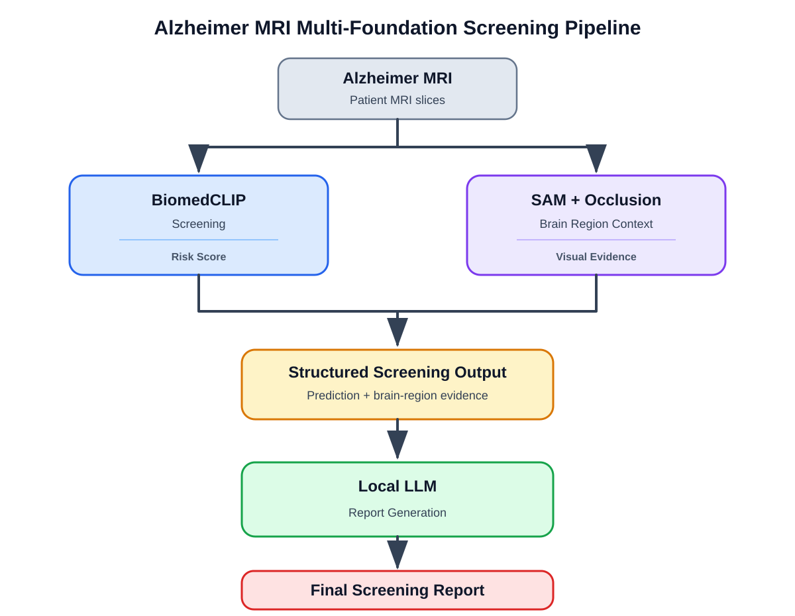
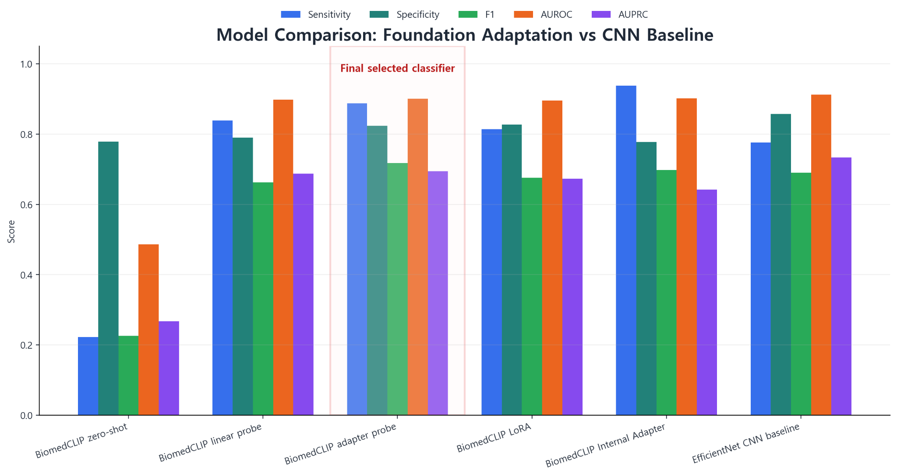
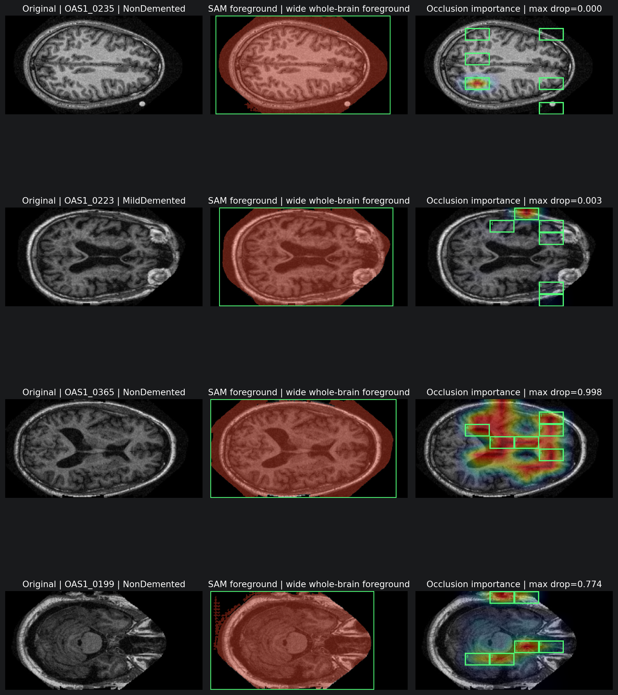
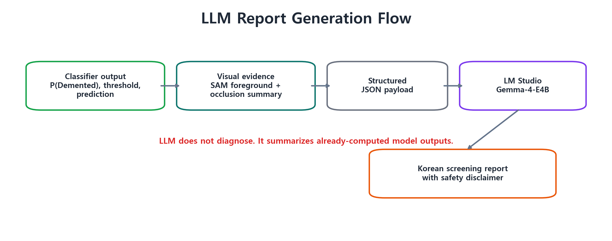
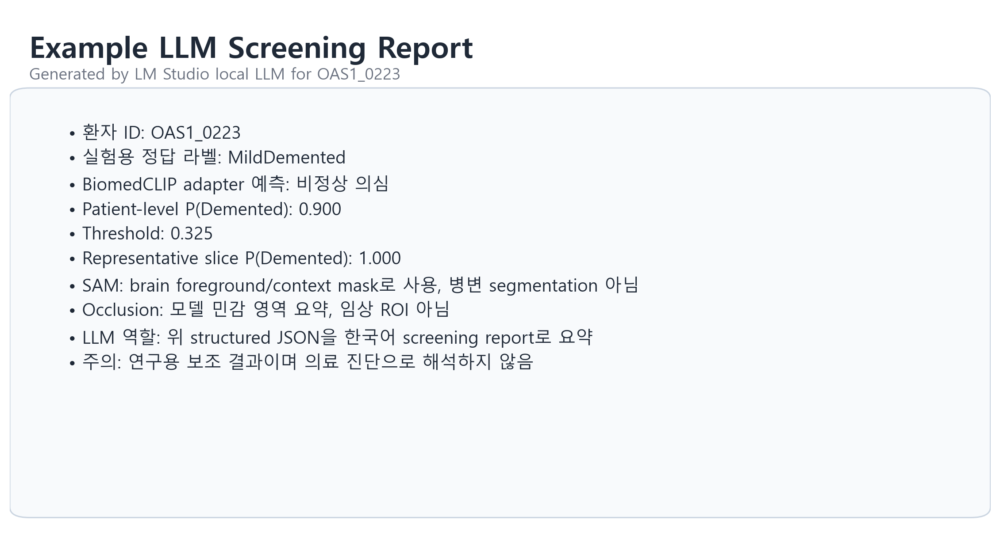

# Alzheimer MRI Multi-Foundation Screening Pipeline

A patient-level Alzheimer MRI screening pipeline combining **BiomedCLIP**, **SAM + occlusion**, and a **local LLM** for prediction, visual context, and report generation.

> Research prototype for screening experiments — **not a medical diagnostic system**.

<p align="center">
  
</p>

## Key Results

**Selected screening model:** frozen BiomedCLIP image encoder + lightweight adapter probe

| Sensitivity | Specificity | Macro F1 | AUROC | AUPRC |
|---:|---:|---:|---:|---:|
| **0.887** | 0.823 | **0.802** | **0.901** | 0.695 |

The operating threshold was chosen for a **sensitivity-first screening setting**, where reducing false negatives is prioritized over maximizing precision.

<p align="center">
  
</p>

The BiomedCLIP adapter probe is the **final selected classifier**, chosen for sensitivity-first screening and parameter-efficient foundation-model adaptation. EfficientNet remains stronger on AUROC/AUPRC.

Full comparison: [`results/final_model_comparison_table.csv`](results/final_model_comparison_table.csv)

## What This Project Does

The pipeline separates **screening** from **visual context generation**, then combines both into a structured output that a local LLM converts into a report.

- **BiomedCLIP screening:** frozen image encoder + adapter probe produces a patient-level risk score.
- **SAM + occlusion:** provides brain-region context and model-derived visual evidence.
- **Structured screening output:** combines prediction results and explanation metadata.
- **Local LLM:** generates a final report from structured model outputs; it does **not** classify MRI images directly.

## Key Research Decisions

### 1. Preventing slice leakage

The original image-level split was replaced with a **patient-level split**. Multiple MRI slices from the same patient must not appear across both train and test sets, because this can leak patient-specific information and overestimate performance.

### 2. Redefining the task

The initial 4-class severity classification task was changed to **binary screening**:

- `NonDemented`
- `Demented = VeryMildDemented + MildDemented + ModerateDemented`

`ModerateDemented` contained too few patients for stable 4-class evaluation.

### 3. Moving beyond zero-shot prediction

Zero-shot BiomedCLIP performed poorly on this task:

| Metric | Zero-shot |
|---|---:|
| Sensitivity | 0.223 |
| AUROC | 0.486 |
| AUPRC | 0.268 |

MRI differences associated with dementia are subtle, and prompt-image similarity alone did not provide an adequate dataset-specific decision boundary. This motivated probe-based adaptation.

### 4. Selecting the adapter probe

The adapter probe was selected because it best matched the project goal of **parameter-efficient foundation-model adaptation for sensitivity-first screening**.

- It substantially improved over zero-shot BiomedCLIP.
- It adds a small nonlinear task-specific adaptation layer while keeping the BiomedCLIP encoder frozen.
- It was more stable than internal LoRA fine-tuning on the small dataset.
- It achieved higher sensitivity than the CNN baseline, although the CNN remained stronger on some ranking metrics.

> The conclusion is **not** that the foundation model beats CNNs in every metric. The EfficientNet baseline remains a strong supervised baseline, especially for AUROC/AUPRC.

### 5. Keeping explanation separate from diagnosis

SAM foreground masks and occlusion heatmaps are used only as **model-side visual context**.

- SAM output is **not** Alzheimer lesion segmentation.
- Occlusion maps are **not** clinical regions of interest.
- Neither should be interpreted as medical diagnosis.

## Representative Visual Evidence

<p align="center">
  
</p>

SAM is used to provide brain-region context, while occlusion sensitivity helps show which image regions most affect the model prediction.

## Report Generation

The final stage converts model outputs into a structured representation and sends that representation to a local LLM.

<p align="center">
  
</p>

The LLM is therefore a **report-generation module**, not an MRI classifier.

<p align="center">
  
</p>

## Final Model Performance

| Metric | Value |
|---|---:|
| Sensitivity | **0.887** |
| Specificity | 0.823 |
| Precision | 0.604 |
| F1 | 0.718 |
| Macro F1 | **0.802** |
| AUROC | **0.901** |
| AUPRC | 0.695 |

The moderate precision means some `NonDemented` patients can be flagged as `Demented`. This is acceptable only as a first-pass research screening signal and must not be interpreted as diagnosis.

`results/adapter_probe_oof_metrics.json` is retained as a raw audit artifact from recalculated patient-level OOF outputs. The README and comparison table use the rounded final reporting values above for consistency.

## Limitations

- The project uses **2D slices**, not full 3D MRI volumes.
- The dataset is **small and imbalanced**.
- Binary screening is more stable than 4-class severity classification, but less clinically granular.
- The sensitivity-first operating point increases false positives.
- The CNN baseline remains stronger in some ranking metrics such as AUROC/AUPRC.
- SAM is a general segmentation foundation model and should not be interpreted as Alzheimer-specific lesion segmentation.
- The local LLM only summarizes structured model outputs.

## Quick Start

```powershell
conda env create -f environment.yml
conda activate alzheimer-repro
```

or

```powershell
pip install -r requirements.txt
```

Copy the configuration file:

```powershell
copy config.example.json config.local.json
```

Then set `dataset_dir` in `config.local.json` to your local dataset path.

<details>
<summary><strong>Dataset layout</strong></summary>

```text
alzheimer_dataset/
  NonDemented/
  VeryMildDemented/
  MildDemented/
  ModerateDemented/
```

Each class folder should contain 2D MRI slice images such as `.jpg`, `.png`, or `.bmp`.

</details>

<details>
<summary><strong>Reproduction steps</strong></summary>

### Level 0 — Inspect saved results

```powershell
python scripts\00_check_environment.py --config config.local.json
python scripts\04_evaluate_saved_results.py --config config.local.json
```

### Level 1 — Rebuild dataset manifest

```powershell
python scripts\01_build_manifest.py --config config.local.json
```

### Level 2 — Recompute BiomedCLIP feature cache

```powershell
python scripts\02_extract_biomedclip_features.py --config config.local.json
```

Feature caching intentionally uses:

- no augmentation
- no sampler
- `shuffle=False`

This keeps the feature cache deterministic.

### Level 3 — Retrain adapter probe

```powershell
python scripts\03_train_adapter_probe.py --config config.local.json
```

### Level 4 — Regenerate LLM reports

Start the LM Studio local server, load the configured model, then run:

```powershell
python scripts\05_generate_llm_reports.py --config config.local.json
```

</details>

<details>
<summary><strong>Repository structure</strong></summary>

```text
.
|-- README.md
|-- config.example.json
|-- requirements.txt
|-- environment.yml
|-- src/dl_project_repro/       # reusable Python code
|-- scripts/                    # step-by-step reproduction scripts
|-- notebooks/                  # final reproducible notebook
|-- notebooks/archive/          # legacy experiment notebooks
|-- docs/                       # project write-up and method notes
|-- results/                    # saved CSV/JSON results
|-- checkpoints/                # adapter probe checkpoints
|-- reports/                    # LLM prompts and generated reports
|-- assets/                     # figures for README/PPT
|-- outputs/                    # generated outputs, cache, temporary files
```

</details>

## Additional Figures

- Detailed original pipeline: [`assets/01_final_pipeline_diagram.png`](assets/01_final_pipeline_diagram.png)
- Project decision flow: [`assets/02_project_decision_flow.png`](assets/02_project_decision_flow.png)
- Dataset distribution: [`assets/03_dataset_patient_distribution.png`](assets/03_dataset_patient_distribution.png)
- Model comparison: [`assets/04_model_metric_comparison.png`](assets/04_model_metric_comparison.png)
- Final model scorecard: [`assets/06_final_model_scorecard.png`](assets/06_final_model_scorecard.png)
- SAM/Occlusion cases: [`assets/09_sam_occlusion_representative_cases.png`](assets/09_sam_occlusion_representative_cases.png)

## Repository Notes

- Do not commit raw medical image data.
- Do not commit large feature cache files under `outputs/cache/`.
- Use Git LFS or releases for large checkpoints if needed.
- Keep `config.local.json` private and commit only `config.example.json`.
