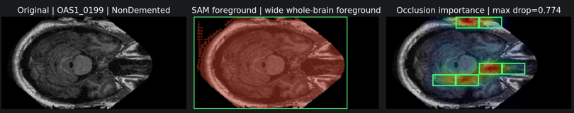
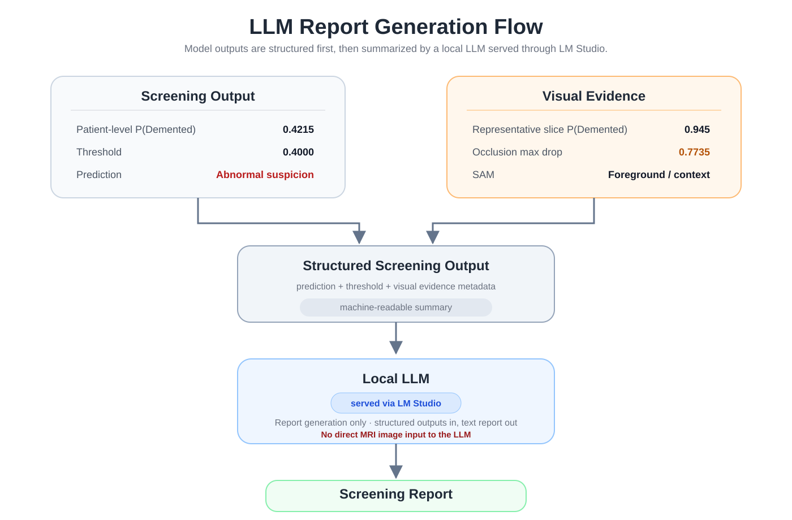
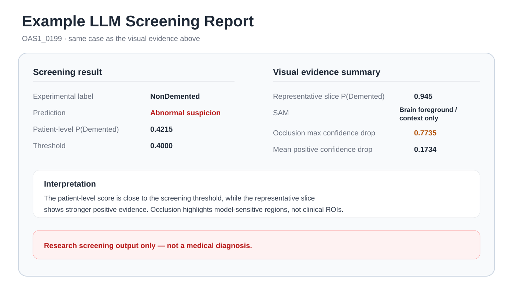

# Alzheimer MRI Multi-Foundation Screening Pipeline

A patient-level Alzheimer MRI screening pipeline combining **BiomedCLIP**, **SAM + occlusion**, and a **local LLM** for prediction, visual context, and report generation.

> Research prototype for screening experiments — **not a medical diagnostic system**.

<p align="center">
  
</p>

## Key Results

**Selected screening model:** frozen BiomedCLIP image encoder + lightweight adapter probe

**Reported comparison metrics below are the mean across 5 patient-level folds.**

| Sensitivity | Specificity | Macro F1 | AUROC | AUPRC |
|---:|---:|---:|---:|---:|
| **0.888** | 0.823 | **0.802** | **0.901** | 0.695 |

The operating threshold was chosen for a **sensitivity-first screening setting**, where reducing false negatives is prioritized over maximizing precision.

The BiomedCLIP adapter probe is the **final selected classifier**, chosen for sensitivity-first screening and parameter-efficient foundation-model adaptation. EfficientNet remains stronger on AUROC/AUPRC.

A post-project follow-up completed the previously deferred **Internal Adapter 5-fold validation**. Its mean AUROC remained essentially comparable to the adapter probe (`0.9014` vs `0.9010`), but its mean sensitivity was lower (`0.8125` vs `0.8875`) and substantially more variable across folds (`SD 0.1712` vs `0.1118`). This follow-up therefore supports retaining the adapter probe rather than changing the final classifier.

Full comparison: [`results/final_model_comparison_table.csv`](results/final_model_comparison_table.csv)

## What This Project Does

The pipeline separates **screening** from **visual context generation**, then combines both into a structured output that a local LLM converts into a report.

- **BiomedCLIP screening:** frozen image encoder + adapter probe produces a patient-level risk score.
- **SAM + occlusion:** provides brain-region context and model-derived visual evidence.
- **Structured screening output:** combines prediction results and explanation metadata.
- **Local LLM:** generates a final report from structured model outputs; it does **not** classify MRI images directly.

## Dataset & Data Source

This project uses the Kaggle dataset **[OASIS Alzheimer's Detection](https://www.kaggle.com/datasets/ninadaithal/imagesoasis)** by Ninad Aithal, which is a processed 2D image derivative of the **OASIS-1 Cross-Sectional MRI dataset**.

The original OASIS-1 dataset is maintained by the Open Access Series of Imaging Studies (OASIS). The Kaggle distribution converts the source MRI data into 2D image slices and provides four dementia-related folders that are used as the starting labels for this project.

- **Processed dataset used in this project:** [OASIS Alzheimer's Detection — Kaggle](https://www.kaggle.com/datasets/ninadaithal/imagesoasis)
- **Original source dataset:** [OASIS-1 Cross-Sectional MRI Data](https://www.oasis-brains.org/)
- **Original OASIS-1 publication:** Marcus et al., *Journal of Cognitive Neuroscience*, 2007. DOI: [10.1162/jocn.2007.19.9.1498](https://doi.org/10.1162/jocn.2007.19.9.1498)

For this project, patient identifiers were reconstructed from the image filenames before model evaluation. This resulted in **347 unique patients** in the working dataset. All train/test splits were then performed at the **patient level**, so slices from the same patient could not appear in both training and evaluation sets.

The original four folders were later grouped into the binary Stage 1 screening task used throughout the final pipeline:

- `NonDemented`
- `Demented = VeryMildDemented + MildDemented + ModerateDemented`

Raw medical images are **not included in this repository**. Users who want to reproduce the project should obtain the dataset from the original distribution source and configure `dataset_dir` locally.

## Key Research Decisions

A detailed record of the version-by-version rationale, scope changes, deferred experiments, and the later Internal Adapter follow-up is available in [`docs/research_decision_log.md`](docs/research_decision_log.md).

### 1. Preventing slice leakage

The original image-level split was replaced with a **patient-level split**. Multiple MRI slices from the same patient must not appear across both train and test sets, because this can leak patient-specific information and overestimate performance.

### 2. Redefining the task

The project intentionally moved away from severity-oriented multi-class prediction and focused on **binary screening**:

- `NonDemented`
- `Demented = VeryMildDemented + MildDemented + ModerateDemented`

The main reason was the research objective: Alzheimer-related screening and early detection were treated as more important than grading disease severity within this project. The very small `ModerateDemented` patient count also made stable multi-class evaluation less attractive.

### 3. Moving beyond zero-shot prediction

Zero-shot BiomedCLIP performed poorly on this task:

| Metric | Zero-shot |
|---|---:|
| Sensitivity | 0.223 |
| AUROC | 0.486 |
| AUPRC | 0.268 |

MRI differences associated with dementia are subtle, and prompt-image similarity alone did not provide an adequate dataset-specific decision boundary. This motivated probe-based adaptation.

### 4. Selecting the adapter probe

The adapter probe was selected as the **practical final classifier** because it best matched the project goal of parameter-efficient foundation-model adaptation for sensitivity-first screening while leaving enough project scope for multi-foundation integration.

- It substantially improved over zero-shot BiomedCLIP.
- It adds a small nonlinear task-specific adaptation layer while keeping the BiomedCLIP encoder frozen.
- It was fully evaluated across all 5 patient-level folds.
- It performed strongly relative to the fully evaluated LoRA experiment.
- It achieved higher sensitivity than the CNN baseline, although the CNN remained stronger on some ranking metrics.

At the original project cutoff, the **Internal Adapter** remained only a Fold-1 pilot because the remaining project time was allocated to multi-foundation integration. Its Fold-1 result was promising (`Sensitivity = 0.9375`, `AUROC = 0.9016`), so it was correctly recorded as a deferred validation question rather than a negative result.

The later **ver19 follow-up** completed the same Internal Adapter configuration across all 5 patient-level folds. The result was more variable than the original Fold-1 pilot suggested:

| Metric | Adapter Probe | Internal Adapter follow-up |
|---|---:|---:|
| Sensitivity mean | **0.8875** | 0.8125 |
| Sensitivity SD | **0.1118** | 0.1712 |
| Specificity mean | 0.8233 | 0.8235 |
| Macro F1 mean | **0.8021** | 0.7748 |
| AUROC mean | 0.9010 | **0.9014** |
| AUPRC mean | **0.6947** | 0.6794 |
| Trainable params | **133,762** | 199,298 |

Internal Adapter sensitivity ranged from `0.5625` to `1.0000` across folds, and its selected validation threshold also varied substantially (`0.250` to `0.650`). Its ranking performance remained competitive, but the screening operating point was less stable. This follow-up strengthens the evidence for retaining the adapter probe as the final classifier.

The decision to stop deeper classifier-specific optimization during the original project was still a scope choice: the project aimed to preserve pretrained foundation-model representations with lightweight adaptation and then combine complementary foundation-model components, rather than exhaustively fine-tune one classifier.

> The conclusion is **not** that the foundation model beats CNNs in every metric. The EfficientNet baseline remains a strong supervised baseline, especially for AUROC/AUPRC.

### 5. Keeping explanation separate from diagnosis

SAM foreground masks and occlusion heatmaps are used only as **model-side visual context**.

- SAM output is **not** Alzheimer lesion segmentation.
- Occlusion maps are **not** clinical regions of interest.
- Neither should be interpreted as medical diagnosis.

## Representative Visual Evidence

The representative explanation is intentionally kept to a single case, **OAS1_0199**, so the visual evidence and the downstream LLM report refer to the same patient.

<p align="center">
  
</p>

For this case, the representative slice has `P(Demented) = 0.945`, and the maximum confidence drop under occlusion is `0.7735`. SAM is used only for brain foreground/context, while the occlusion map shows model-sensitive regions rather than clinical ROIs.

## Report Generation

The final stage converts model outputs into a structured representation and sends that representation to a local LLM.

<p align="center">
  
</p>

The LLM is served locally through **LM Studio** and is used only as a **report-generation module**. It receives structured screening outputs rather than MRI images directly. The example below uses the **same OAS1_0199 case** shown in the visual evidence above.

<p align="center">
  
</p>

The underlying structured input for OAS1_0199 contains patient-level `P(Demented) = 0.4215`, threshold `0.4000`, representative-slice `P(Demented) = 0.945`, and occlusion max confidence drop `0.7735`. The full generated report is retained in [`reports/llm_reports/OAS1_0199_llm_report.md`](reports/llm_reports/OAS1_0199_llm_report.md).

## Final Model Performance

The table below reports **mean performance across the 5 patient-level folds** for the selected adapter probe.

| Metric | Value |
|---|---:|
| Sensitivity | **0.888** |
| Specificity | 0.823 |
| Precision | 0.604 |
| F1 | 0.718 |
| Macro F1 | **0.802** |
| AUROC | **0.901** |
| AUPRC | 0.695 |

The supplementary confusion matrix is computed from **pooled out-of-fold (OOF) predictions across all 347 patients**. Because fold-level metrics are averaged with equal fold weight while pooled OOF metrics are computed once from all patient predictions, small numerical differences are expected. For example, mean 5-fold sensitivity is `0.8875` (reported as `0.888`), while pooled OOF sensitivity is `72 / 81 = 0.8889`.

The moderate precision means some `NonDemented` patients can be flagged as `Demented`. This is acceptable only as a first-pass research screening signal and must not be interpreted as diagnosis.

`results/adapter_probe_oof_metrics.json` is retained as a raw audit artifact for pooled patient-level OOF performance. The README model-comparison values use the 5-fold mean values from [`results/final_model_comparison_table.csv`](results/final_model_comparison_table.csv).

## Limitations

- The project uses **2D slices**, not full 3D MRI volumes.
- The dataset is **small and imbalanced**.
- Binary screening is less clinically granular than severity classification, but it was intentionally chosen to match the project screening objective.
- The sensitivity-first operating point increases false positives.
- The CNN baseline remains stronger in some ranking metrics such as AUROC/AUPRC.
- The Internal Adapter follow-up showed substantial fold-to-fold sensitivity and threshold variability, indicating that stronger encoder-internal adaptation was less stable under this dataset and evaluation setup.
- SAM is a general segmentation foundation model and should not be interpreted as Alzheimer-specific lesion segmentation.
- The local LLM only summarizes structured model outputs.

## Quick Start

```powershell
conda env create -f environment.yml
conda activate alzheimer-repro
```

or

```powershell
pip install -r requirements.txt
```

Copy the configuration file:

```powershell
copy config.example.json config.local.json
```

Then set `dataset_dir` in `config.local.json` to your local dataset path.

<details>
<summary><strong>Dataset layout</strong></summary>

```text
alzheimer_dataset/
  NonDemented/
  VeryMildDemented/
  MildDemented/
  ModerateDemented/
```

Each class folder should contain 2D MRI slice images such as `.jpg`, `.png`, or `.bmp`.

</details>

<details>
<summary><strong>Reproduction steps</strong></summary>

### Level 0 — Inspect saved results

```powershell
python scripts\00_check_environment.py --config config.local.json
python scripts\04_evaluate_saved_results.py --config config.local.json
```

### Level 1 — Rebuild dataset manifest

```powershell
python scripts\01_build_manifest.py --config config.local.json
```

### Level 2 — Recompute BiomedCLIP feature cache

```powershell
python scripts\02_extract_biomedclip_features.py --config config.local.json
```

Feature caching intentionally uses:

- no augmentation
- no sampler
- `shuffle=False`

This keeps the feature cache deterministic.

### Level 3 — Retrain adapter probe

```powershell
python scripts\03_train_adapter_probe.py --config config.local.json
```

### Level 4 — Regenerate LLM reports

Start the LM Studio local server, load the configured model, then run:

```powershell
python scripts\05_generate_llm_reports.py --config config.local.json
```

</details>

<details>
<summary><strong>Repository structure</strong></summary>

```text
.
|-- README.md
|-- config.example.json
|-- requirements.txt
|-- environment.yml
|-- src/dl_project_repro/       # reusable Python code
|-- scripts/                    # step-by-step reproduction scripts
|-- notebooks/                  # reproducible notebook + follow-up validation
|-- notebooks/archive/          # legacy experiment notebooks
|-- docs/                       # project write-up and method notes
|-- results/                    # saved CSV/JSON results
|-- checkpoints/                # adapter probe checkpoints
|-- reports/                    # LLM prompts and generated reports
|-- assets/                     # project visualizations
|-- outputs/                    # generated outputs, cache, temporary files
```

</details>

## Supplementary Visualizations

These figures are retained as supporting material for deeper inspection rather than being inserted into every section of the main README.

- Project decision flow: [`assets/02_project_decision_flow.svg`](assets/02_project_decision_flow.svg)
- Dataset distribution and binary task redefinition: [`assets/03_dataset_patient_distribution.svg`](assets/03_dataset_patient_distribution.svg)
- Adapter probe pooled OOF confusion matrix: [`assets/07_confusion_matrix_adapter.svg`](assets/07_confusion_matrix_adapter.svg)
- Detailed pipeline: [`assets/detailed_pipeline.png`](assets/detailed_pipeline.png)
- Full SAM/Occlusion case panel: [`assets/sam_occlusion_all_cases.png`](assets/sam_occlusion_all_cases.png)

## Repository Notes

- Do not commit raw medical image data.
- Do not commit large feature cache files under `outputs/cache/`.
- Use Git LFS or releases for large checkpoints if needed.
- Keep `config.local.json` private and commit only `config.example.json`.
